# Envizi Travel Usecase

In this article lets explore about the How to create travel use related data, reports and disclosures.

## 1 Data Model

We are going to create a data model like this. 

## 2. Create Org Hierarchy and Data

#### Create Org Hierarchy 

1. Create the org hierarchy by uploding this [file](./files/Envizi_SetupConfig_Wwv.xlsx) (change the file content according do you need)

The org hierarchy may get created like this.

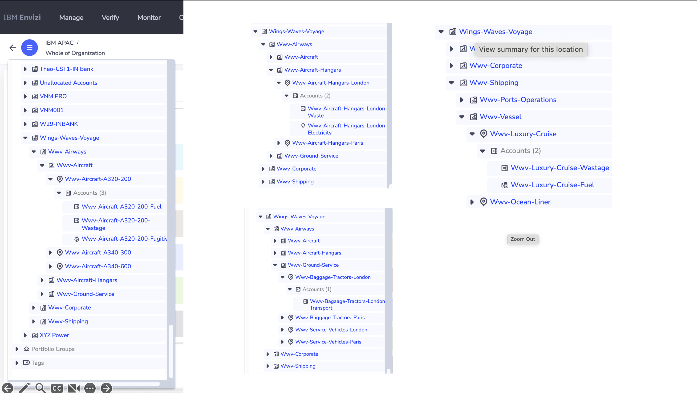

Here is the Groups list.

Here is the Locations list.

#### Create Accounts and Data

1. Create the Accounts and Data by uploding this [file](./files/POCAccountSetupandDataLoad_Wwv.xlsx) (change the file content according do you need)

The account may get created like this.

The account summary will look like this. 

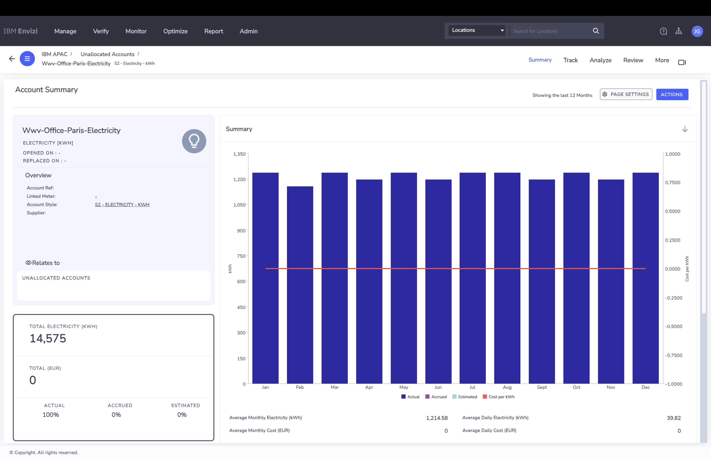

You can see the Factor set applied for this account.

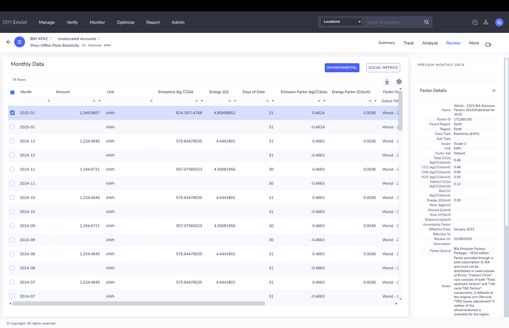

## 3. View the Performance

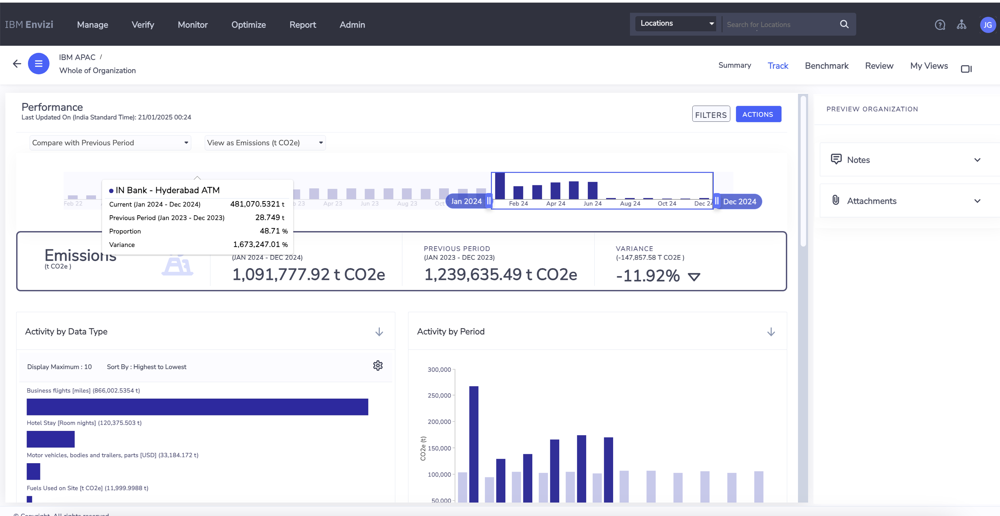

## 4. View the Emission Performance

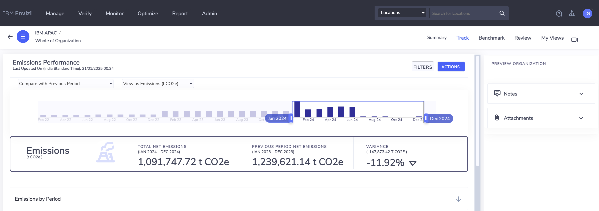
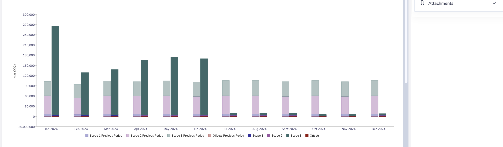
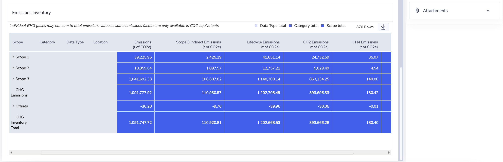

## 5. Custom Factors

The custom factors can be created like this.

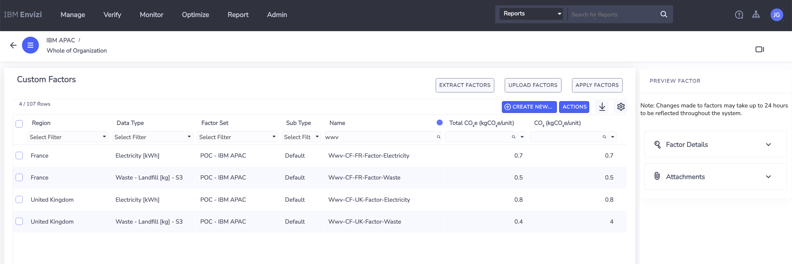

## 6. Programs

The Programs, Actions Plans and Actions can be created like this.

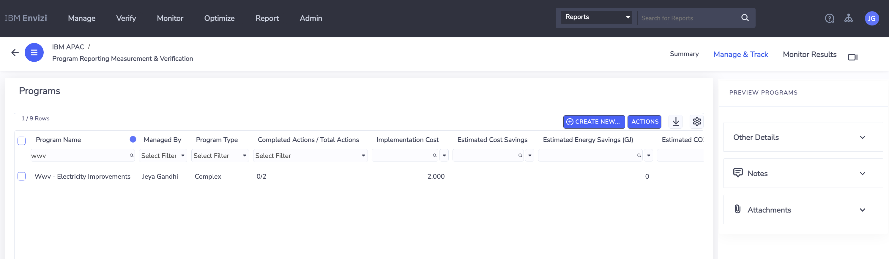
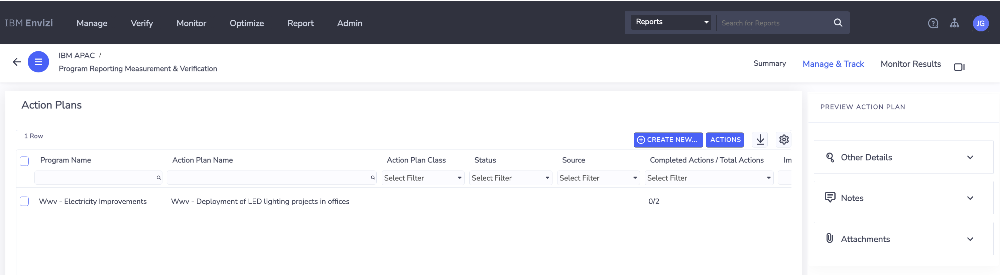
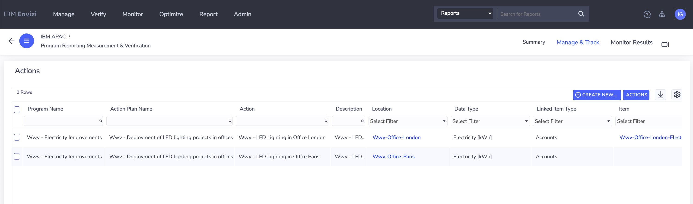

## 7. Targets

The Targets can be created like this.

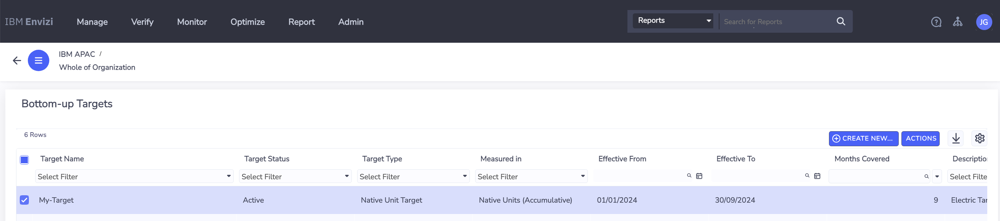

## 7. SRM

The sustainability disclouse report can be created like this.

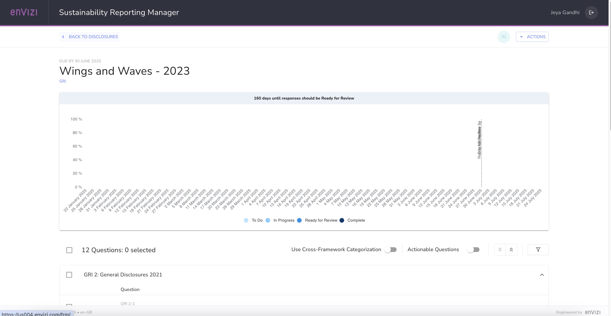

## 8. Scope 3

The Scope 3 Emissions report is available here.

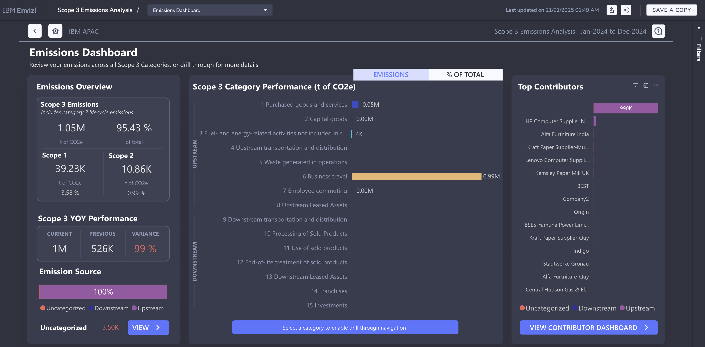

