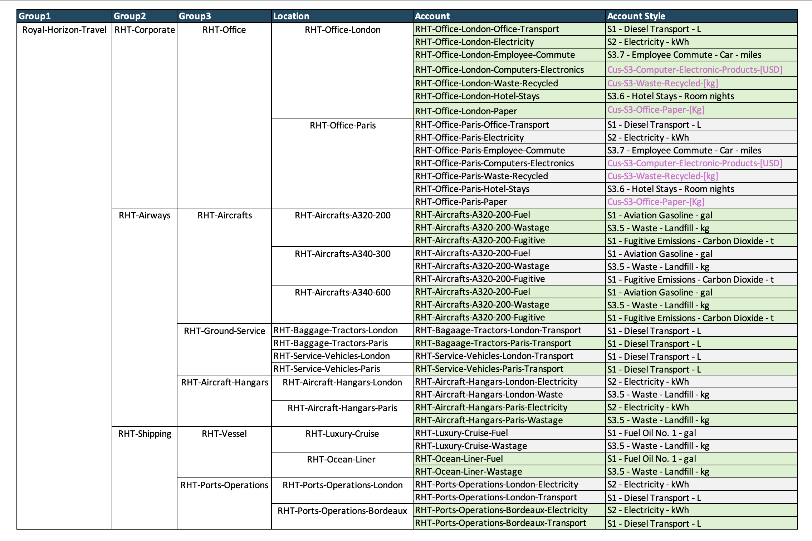

# Envizi Travel Use case

In this article lets explore about  How to create travel use case related data, reports and disclosures.

IBM Envizi ESG Suite is an ESG data management platform. 

In this article lets explore how Envizi is helping to manage ESG Data for the Travel Industry.

The `Royal Horizon Travel` is an UK based organization they operate both Air Craft and Vessel. They want to capture their ESG Data in the Envizi Platform, do the analysis, create reports and disclosures and execute their decarbonization strategy.

Lets explore how they can use Envizi to achieve their plan.

In this article we cover the following topics.

1. Define and Create Organization Hierarchy
2. Create and Load account data
3. Review the Account Summary, 
4. Review the Organization Performance and Emission Performance
5. Custom Emission Factors
6. Programs Setup and Actions
7. Targets setting and Tracking
8. Sustainability Reporting Manager
9. Scope 3 Emission Report
10. Monthly Data Summary extract report
11. Sustainability Executive Report
12. Account styles

## 1 Data Model

We are going to create a data model like this. 

## 2. Create Org Hierarchy and Data

#### Create Org Hierarchy 

1. Create the org hierarchy by uploading this setup config excel [file](./files/Envizi_SetupConfig_RHT.xlsx) (change the file content according do you need)

The file upload status would be like this.

The below groups get created and available in the Groups screen.

The below location get created and available in the Location screen.

#### Create Accounts and Data

1. Create the Accounts and Data by uploading the below files.

- [POCAccountSetupandDataLoad_RHT.xlsx](./files/POCAccountSetupandDataLoad_RHT.xlsx)
- [Account_Setup_and_Data_Load_-_PM&C-RHT.xlsx](./files/POCAccountSetupandDataLoad_RHT.xlsx)  . Replace the `Organization Link`,    `Organization` and `Account Style Link` columns according to your environment.

The below accounts get created and available in Accounts screen.

#### Org Hierarchy

The org hierarchy with the above created Groups/Locations/Accounts would be like this.

#### Account Summary

The account summary will look like this. 

You can observe the following.
- Account Name (1)
- Account style of the account (2)
- Total consumption (3)
- Month wise consumption (4)
- Records entered for the last 12 months (5)

#### Records

You can see all the records created for this account.

Contains the information like start period, end period (1) and quantity (2).

#### Monthly Data

You can see the monthly data for this account.

It also shows the emission factor set mapped to the account.

You can observe the following.
- Month of the record (1)
- The consumption amount (2)
- Emission amount (3)
- The emission factor value applied (4)
- The Factor name applied for the account (5)
- The Data Type of the account (6)
- The emission factor of the data type (7)
- Factor source (8)

## 3. View the Performance

### 3.1 Org Level Performance 

The performance dashboard shows the emission details for the entire organization. Here the filter is applied to the group `Royal Horizon Travel`

You can observe the following.
- Groups filter (1)
- Timeline (2)
- Emissions of Current Period (3)
- Emissions of Previous Period (4)
- Variance % compared to last year (5)

### 3.2 Account Performance

The Account level Performance is available here.

## 4. View the Emission Performance

The emission performance dashboard shows the emission details for the entire organization. This shows the scope wise split up.

Here the filter is applied to the group `Royal Horizon Travel`

You can see the Total emissions (1), scope split-up (2) and  other details.

The detailed scope 1 table (1) is available here.

The detailed scope 2 table (1) is available here.

The detailed scope 3 table (1) is available here.

## 5. Custom Emission Factors

The custom emission factors can be created like this.

You can observe the following.
- Region of the custom factor belongs to (1)
- The data type it belongs to (2)
- The name of the factor (3)
- The total emission value of the Data type (4)
- The effective period of the factor (5)

The above information in the edit screen.
- Region of the custom factor belongs to (1)
- The data type it belongs to (2)
- The total emission value of the Data type (3)
- The effective period of the factor (4)

## 6. Programs and Actions

The Programs, Actions Plans and Actions can be created like this for the decarbonization.

The Program summary page shows the various programs and it status details.

The list of programs available here.

The list of action plan available here.

The list of actions available here.

The action name (1), the associated location (2) and data type (3) are highlighted here.

## 7. Targets Setting and Tracking

The Targets can be created like this.

The full period target data is available here.

The monthly target data is available here.

## 8. Sustainability Reporting Manager

The sustainability reporting manager shows the list of sustainability disclosure reports.

You can observe the following.
- Disclosure name (1)
- The framework included (2) in the report.
- The number of questions (3) in the report

Here is a disclosure that contains 12 GRI questions.

A detailed view of a question is displayed here.

- Name/description of the question (1)
- Response to the question is filled here (2)
- Envizi guidance (3), shows where to get the answer to the question 

## 9. Scope 3 Emission Report

The Scope 3 Emissions report is available here.

You observe the below details.

- Scope 3 emissions (1)
- Scope 1 emissions (2)
- Scope 2 emissions (3)

Choose the category `7 employee commuting` (4) 

Click on the `Select a category to enable drill through navigation` (5) button to see the details.

It shows the `Scope 3 - Category 7 employee commuting` details.

Location wise details available here.

Datatype wise graph is shown here.

## 10. Monthly Data Summary Report

You can select the appropriate filter to choose the Monthly Data Summary report.

- The `Royal-Horizon-Travel` group is selected here

It shows the report here.

The monthly data is shown here.

## 11. Sustainability Executive Report

The Sustainability Executive Report is available here.

It shows the Emissions (1), Energy (2), Waste (3) and other details.

The emissions page shows the `scope 1`  (1), ` scope 2`  (2), ` scope 3`  (3) emission details here.

It also shows the location wise (4) details.

Here is the Energy details.

Here is the Wastage details.

## 12. Account style

The Account styles is available here.

Here is the list of account style available. It shows the different account style with `scope`, `data type` and etc.

We have created 3 custom account styles.

Here is the details of the account styles created.

