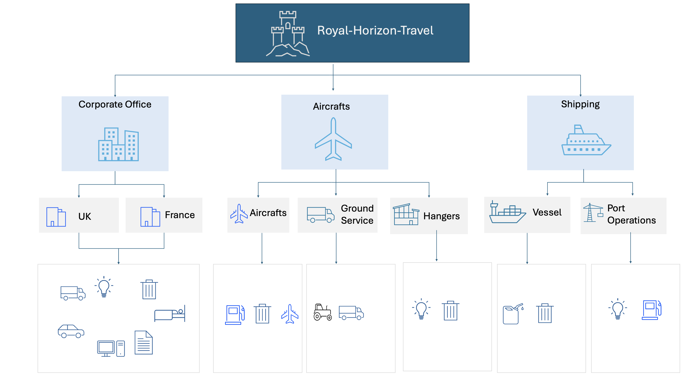
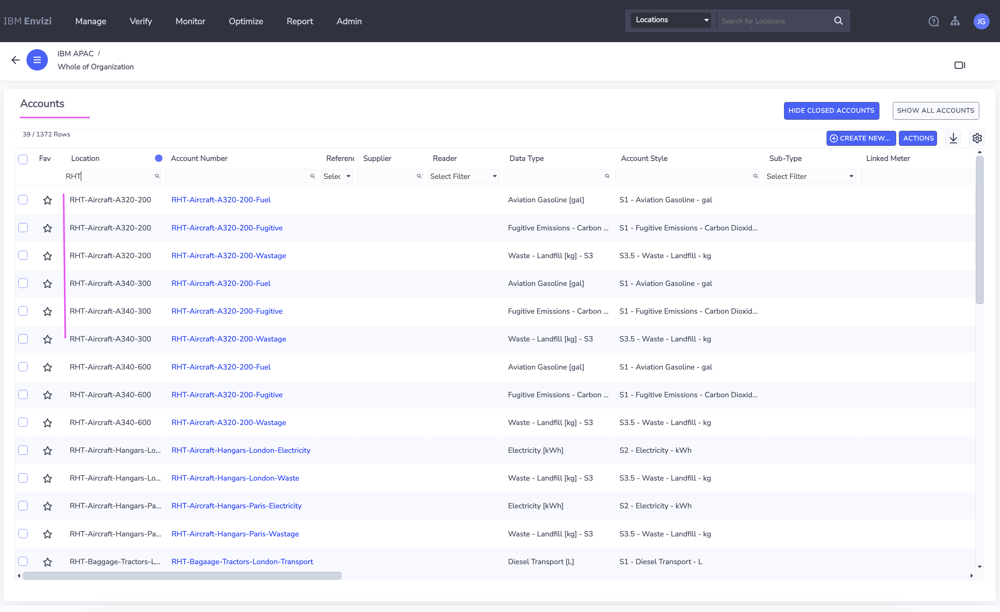

# IBM Envizi for Travel and Transportation

In this tutorial, let's explore how IBM Envizi ESG Suite is helping to manage sustainability data for the Travel and Transportation industry.

## Introduction 
The transportation sector is a major contributor to global greenhouse gases. And over the past decade, governments and private businesses have been cooperating to create a more sustainable infrastructure for moving people and materials across our planet.

The `Royal Horizon Travel` has committed to being carbon netural in their operations by 2040.

#### Business Need
- Improve visibility enhace tracking and montioring their ESG data
- Lower the tracking efforts as it is relied heavily on manual data collection and processing
- Reduce Carbon Emission to meet their netzero targets
- Lower the fuel consumption
- Reduct waste
- Seamless Reporting to disclose to various regulations

#### Persona
1. CEO, Chief Sustainability Officer, Sustainability Manager, CFO, Chief Procurement Officer  
2. VP or Director of Quality, Head of Operation
3. CIO, CTO (IT Manager, IT Director)

#### Solution
IBM Envizi to simplify consolidation, analysis and management of siloed data sources for sustainability reporting frameworks, manage stakeholders and meet sustainability goals.

The asset showcases how IBM Envizi to help automate, capture, and structure your data based on greenhouse gas emissions from your operations including your vendors and contractors. Generate reports according to new regulations and standards, and support decarbonisation initiatives across the value chain and accelerate your decarbonisation journey. This will enable the CSO to make sustainability-led decisions that support decarbonisation. 

#### Business Impact
- Centralized ESG-tracking 
- Reduced GHG Emissions,  
- Ease of capturing, benchmarking. 
- Enables the CSO’s to track and report  on GHG Emissions aligning to different regulatory frameworks.

In this article, we cover the following topics.

- Define and Create Organization Hierarchy and Data
- View Dashboards
- Custom Emission Factors
- Programs and Actions
- Targets Setting and Tracking
- Sustainability Reporting Manager
- View Reports 

## 1 Data Model

The typical data managed by the `Royal Horizon Travel` would be like this.

We are going to create a data model like this. 

## 2. Create Account styles, Groups, Locations, Accounts and Data

### 2.1 Create Account styles

Here is the list of account styles available in this instance of Envizi.

It shows the different account style with `scope`, `data type` and etc.

1. Create the below 3 custom account styles along with the given Data type

- Cus-S3-Computer-and-Electronic-Products-[USD]           ---         Computer and electronic products [USD]
- Cus-S3-Paper-and-Cardboard-[t]                          ---         Waste - Paper and Cardboard [t]
- Cus-S3-Waste-Recycled-[kg]                              ---         Waste Recycled - Mixed Recyclables [kg]

The details of the account styles looks like this.

#### Custom Account Style and Account Mapping

The custom account styles are mapped to few Accounts here.

### 2.2 Create Groups and Locations

1. Create the Groups and Locations by uploading this setup config excel [file](./files/Envizi_SetupConfig_RHT.xlsx) (change the file content according do your need)

The file upload status would be like this.

The below groups get created and available in the Groups screen.

The below location get created and available in the Location screen.

### 2.3 Create Accounts and Data

1. Create the Accounts and Data by uploading the below files.

- [POCAccountSetupandDataLoad_RHT.xlsx](./files/POCAccountSetupandDataLoad_RHT.xlsx)
- [Account_Setup_and_Data_Load_-_PM&C-RHT.xlsx](./files/POCAccountSetupandDataLoad_RHT.xlsx)  . Replace the `Organization Link`,    `Organization` and `Account Style Link` columns according to your environment.

The below accounts get created and available in Accounts screen.

## 3. View Dashboards

### 3.1 View Organization Hierarchy

The org hierarchy with the above created Groups/Locations/Accounts would be like this.

###  3.2 View Account Summary

1. Open the Account Summary page of the `RHT-Bagaage-Tractors-London-Transport` account.

The account summary page will look like this. 

You can observe the following.
- Account Name (1)
- Account style of the account (2)
- Total consumption (3)
- Month wise consumption (4)
- Records entered for the last 12 months (5)

#### Records

Records page list all the records created for this account.

Contains the information like start period, end period (1) and quantity (2).

#### Monthly Data

Monthly Data screen shows the monthlwise data for this account.

It also shows the emission factor set mapped to the account.

You can observe the following.
- Month of the record (1)
- The consumption amount (2)
- Emission amount (3)
- The emission factor value applied (4)
- The Factor name applied for the account (5)
- The Data Type of the account (6)
- The emission factor of the data type (7)
- Factor source (8)

### 3.3 View Org Level Performance 

The performance dashboard shows the emission details for the entire organization. Here the filter is applied to the group `Royal Horizon Travel`

You can observe the following.
- Groups filter (1)
- Timeline (2)
- Emissions of Current Period (3)
- Emissions of Previous Period (4)
- Variance % compared to last year (5)

### 3.4 View Account Performance

The Account level Performance is available here.

### 3.5 View Emission Performance

The emission performance dashboard shows the emission details for the entire organization. 

Here the filter is applied to the group `Royal Horizon Travel`

You can see the Total emissions (1), scope split-up (2) and  other details.

The detailed scope 1 table is available here.

The detailed scope 2 table is available here.

The detailed scope 3 table is available here.

### 3.6 View Custom Factor mapping

You can see the above created custom account styles are mapped to Accounts here.

## 4. Custom Emission Factors

### 4.1 Create Custom Emission Factor

1. Create the below 4 custom factors.

The key fields to note are as follows.
- Region of the custom factor belongs to (1)
- The data type it belongs to (2)
- The name of the factor (3)
- The total emission value of the Data type (4)
- The effective period of the factor (5)

### 4.2 View the factor mapping

The above created Emission factor is mapped to the Account based on the Region, effective date.

1. Open the  `Account > Monthly Data` screen for the account `RHT-Aircraft-Hangars-London-Electricity`

2. Observe the following mapping.

- Account : `RHT-Aircraft-Hangars-London-Electricity` (1) 
- Emission Factor : ` RHT-CF-UK-Factor-Electricity`  (2), (5)
- Factor value : 0.8 (3), (6)
- Region : UK (4)

## 5. Programs and Actions

The Programs, Actions Plans and Actions can be created like this for the decarbonization.

### 5.1 Create Programs and Actions

1. Create the below Program 

2. Create the Action Plan for the above created program

3. Create the Actions for the above action plan

The key fields to note are as follows.
 - action name (1), 
 - associated location (2) 
 - data type (3)

### 5.2 View Programs Summary

The Program summary page shows the various programs and it status details.

## 6. Targets Setting and Tracking

### 6.1 Create Targets

1. Create the below Target

2. Create the full period target data like this

3. Create the monthly target data like this

## 7. Sustainability Reporting Manager

The sustainability reporting manager shows the list of sustainability disclosure reports.

### 7.1 Create Disclosure 

1. Create Disclosure with the following info.

- Disclosure name (1)
- The framework included (2) in the report.
- The number of questions (3) in the report

Here is a disclosure that contains 12 GRI questions.

A detailed view of a question is displayed here.

- Name/description of the question (1)
- Response to the question to be filled here (2)
- Envizi guidance (3), shows where to get the answer to the question 

## 8. View Reports 

### 8.1 Scope 3 Emission Report

The Scope 3 Emissions report is available here.

You observe the below details.

- Scope 3 emissions (1)
- Scope 1 emissions (2)
- Scope 2 emissions (3)

Choose the category `7 employee commuting` (4) 

Click on the `Select a category to enable drill through navigation` (5) button to see the details.

It shows the `Scope 3 - Category 7 employee commuting` details.

Location wise details available here.

Datatype wise graph is shown here.

### 8.2. Sustainability Executive Report

The Sustainability Executive Report is available here.

It shows the Emissions (1), Energy (2), Waste (3) and other details.

The emissions page shows the `scope 1`  (1), ` scope 2`  (2), ` scope 3`  (3) emission details here.

It also shows the location wise (4) details.

Here is the Energy details.

Here is the Wastage details.

### 8.3 Monthly Data Summary Report

You can select the appropriate filter to choose the Monthly Data Summary report.

- The `Royal-Horizon-Travel` group is selected here

It shows the report here.

The monthly data is shown here.

